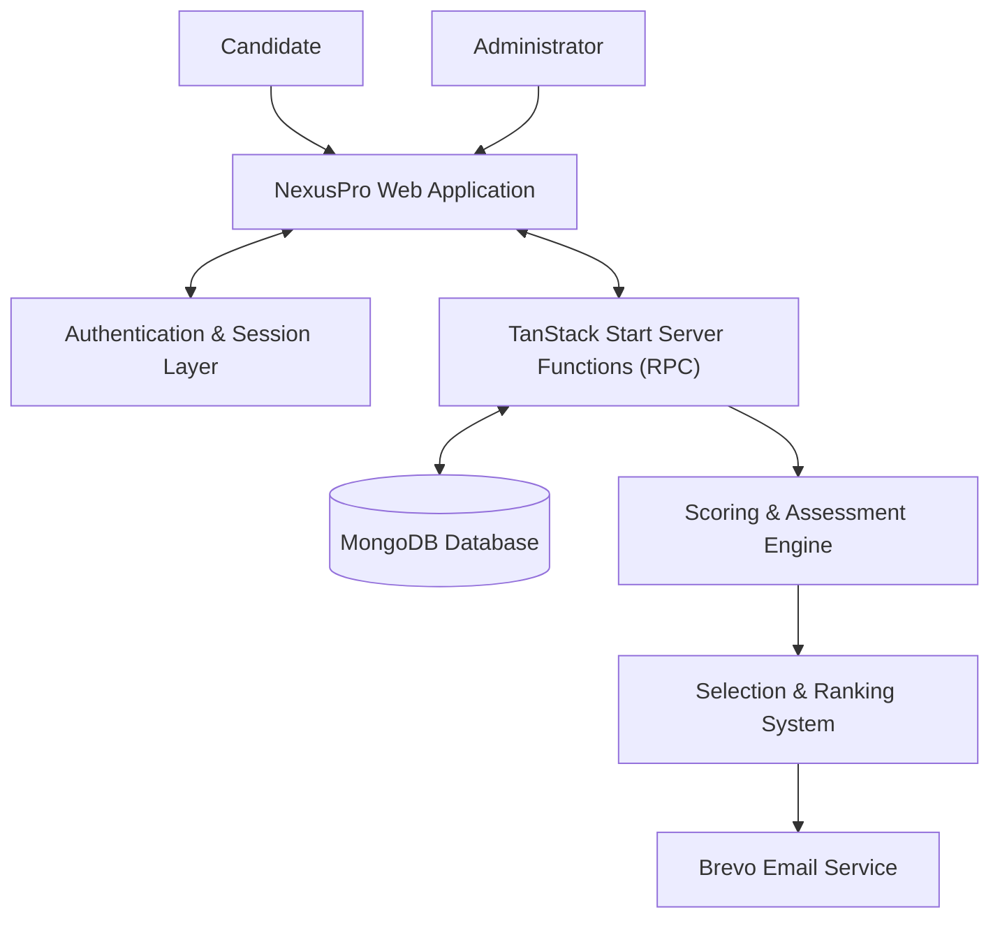

# NEXUSPRO

An interactive, highly-secure, cinematic assessment platform designed for enterprise candidate evaluation and selection.

[]()
[]()
[]()
[]()
[]()
[]()

---

## Table of Contents

- [Overview](#overview)
- [Feature Matrix](#feature-matrix)
- [System Architecture](#system-architecture)
- [Technology Stack](#technology-stack)
- [Candidate Workflow](#candidate-workflow)
- [Admin Control Center](#admin-control-center)
- [Scoring & Selection System](#scoring--selection-system)
- [Security Architecture](#security-architecture)
- [Database Architecture](#database-architecture)
- [Project Structure](#project-structure)
- [Installation & Development](#installation--development)

---

## Overview

**NexusPro** is an advanced candidate evaluation platform designed to seamlessly integrate secure assessments with a premium, cinematic user experience. Built with React, Framer Motion, and TanStack Start, the platform delivers real-time evaluations across multiple technical and cognitive domains.

Designed for administrators and hiring teams, NexusPro offers a centralized control center to monitor live sessions, manage dynamic question pools, track security logs, and automate the final selection and email notification process for top candidates.

---

## Feature Matrix

| Area | Feature | Status |
|------|---------|--------|
| Candidate | Secure Registration & Resumption | Implemented |
| Assessment | Multiple-Choice (MCQ) Round | Implemented |
| Assessment | Puzzle / Word Guessing Challenge | Implemented |
| Assessment | AI Prompt Strength Evaluation | Implemented |
| Assessment | Fill-in-the-blank Evaluation | Implemented |
| Admin | Live Room & Candidate Management | Implemented |
| Admin | Question Pool Management (MCQ & Puzzle) | Implemented |
| Admin | Comprehensive Analytics & Dashboards | Implemented |
| Admin | Security Audit Logging & Risk Center | Implemented |
| Selection | Automated Ranking & Shortlisting | Implemented |
| Email | Brevo SMTP Integration for Ticketing | Implemented |

---

## System Architecture



---

## Technology Stack

| Layer | Technology |
| :--- | :--- |
| **Frontend Framework** | React 19.2 |
| **Meta Framework** | TanStack Start (Vite) |
| **Routing** | TanStack Router |
| **Styling** | Tailwind CSS v4, Radix UI Primitives |
| **Animations** | Framer Motion |
| **Backend Engine** | Node.js (TanStack Server Functions / Nitro) |
| **Database** | MongoDB |
| **Language** | TypeScript |

---

## Candidate Workflow

1. **Authentication:** Candidates register or resume their session securely.
2. **Assessment Phases:**
   - **MCQ Assessment:** Candidates answer timed multiple-choice questions. Validation and correct answers are strictly processed server-side.
   - **Puzzle Challenge:** A dynamic word-guessing trial with hints and difficulty levels. Incorrect guesses incur penalties.
   - **AI Prompt Assessment:** Evaluates prompt construction capabilities.
   - **Fill-in-the-blank Assessment:** Additional technical evaluation.
3. **Scoring:** The system computes an aggregate score across all rounds.
4. **Conclusion:** Candidates who qualify are ranked on the global leaderboard.

---

## Admin Control Center

The Glassmorphic corporate dashboard provides administrators with complete control over the assessment environment:

- **Live Room:** Monitor active candidate sessions, completion times, and statuses in real-time. Lock or disqualify candidates instantly.
- **Question Management:** Full CRUD capabilities and bulk JSON import for both MCQ and Puzzle question banks.
- **System Rules:** Configure global settings such as session timeouts, max wrong attempts, passing scores, and time limits dynamically.
- **Risk Center & Audit Logs:** Review immutable security logs for suspicious activities, failed authentications, and system anomalies.

---

## Scoring & Selection System

NexusPro includes an automated selection pipeline:

1. **Aggregation:** Combines scores from MCQ, Puzzle, Prompt, and Fill-in-the-blank rounds (Max 25 points).
2. **Ranking:** Candidates are ranked based on total score and completion time.
3. **Snapshot Generation:** Administrators generate selection snapshots based on a predefined shortlist size.
4. **Automated Ticketing:** Selected candidates are automatically assigned unique Ticket IDs.
5. **Email Notification:** The system integrates with the Brevo SMTP API to dispatch formatted HTML selection emails and event instructions to qualified candidates.

---

## Security Architecture

- **Server-Side Validation:** All assessment answers are validated exclusively on the backend. No correct answers are exposed to the client.
- **Session Management:** Secure token-based authentication for both admins and candidates.
- **Immutability:** Security events, state transitions, and anomalies are logged to a dedicated `securityLogs` collection.
- **Action Enforcement:** RPC endpoints rigorously verify candidate state (e.g., locking out users who fail earlier rounds or exceed attempt limits) before processing updates.

---

## Database Architecture

The application relies on MongoDB with optimized collections:

- `students`: Candidate profiles, scores, session states, and selection statuses.
- `questions`: Puzzle/Word challenge question bank.
- `mcqQuestions`: Multiple-choice question bank.
- `securityLogs`: Immutable ledger of security events.
- `systemConfig`: Global assessment rules and parameters.
- `adminSessions` / `studentSessions`: Active authentication tokens.

---

## Project Structure

```text
nexus-judgment/
├── public/                 # Static assets
├── src/
│   ├── components/         # Reusable UI, Admin Tabs, and Assessment Views
│   ├── hooks/              # Custom React hooks
│   ├── lib/
│   │   ├── db.ts                   # MongoDB schema and connection logic
│   │   ├── server-fns.ts           # Primary backend RPC endpoints
│   │   ├── email.ts                # Brevo integration logic
│   │   ├── selection.server.ts     # Selection and ranking algorithms
│   │   └── cron.ts                 # Background jobs
│   ├── routes/             # TanStack file-based routing definitions
│   ├── router.tsx          # Router initialization
│   └── styles.css          # Global Tailwind configurations
├── package.json
└── vite.config.ts
```

---

## Installation & Development

### Prerequisites
- Node.js v22+
- MongoDB instance (local or Atlas)

### Environment Variables
Create a `.env` file in the root directory:
```env
MONGODB_URI=your_mongodb_connection_string
MONGODB_DB_NAME=nexus_judgment
ADMIN_PASSWORD=your_secure_admin_password
BREVO_API_KEY=your_brevo_api_key
BREVO_SENDER_EMAIL=noreply@nexuspro.com
```

### Local Setup

1. **Install dependencies:**
   ```bash
   npm install
   ```

2. **Start the development server:**
   ```bash
   npm run dev
   ```

3. **Build for production:**
   ```bash
   npm run build
   ```
