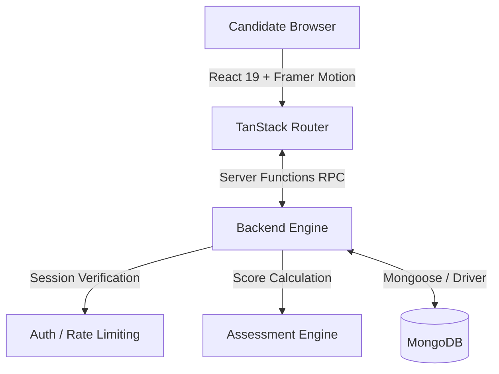

# AI NEXT GEN RESEARCH WORKSHOP 2026
**Guardian of Shadows — The Shadow Realm Trial**

An interactive, highly-secure, cinematic assessment platform designed for candidate evaluation. Candidates participate in a timed, multi-stage assessment consisting of a Multiple-Choice Question (MCQ) round followed by a dynamic Puzzle challenge.

## Overview

This project serves as the core evaluation platform for candidates. It features a robust frontend built with modern React and Framer Motion for cinematic animations, and a secure backend powered by TanStack Server Functions and MongoDB. 

The platform strictly enforces the assessment flow, actively guards against API manipulation, tracks all candidate progress via secure sessions, and provides a real-time admin dashboard for managing the trials.

---

## Core Features

### Candidate Experience
* **Secure Registration & Resumption:** Candidates register using official credentials and are issued a unique 6-character Security PIN. This PIN allows them to resume their session dynamically across devices.
* **MCQ Assessment (Round 1):** A timed multiple-choice questionnaire where validation and scoring are processed entirely server-side to prevent cheating.
* **Puzzle Challenge (Round 2):** Candidates who pass the MCQ round unlock "The Shadow Realm", a cinematic puzzle trial featuring dynamic word-guessing mechanics and penalty scoring.
* **Cinematic UI/UX:** Built with Framer Motion, dynamic backgrounds, and text-to-speech guardian voices.

### Admin Experience
* **Real-time Dashboard:** Track all candidates, scores, and active sessions.
* **Question Management:** Full CRUD capabilities for managing both MCQ and Puzzle questions.
* **Security Auditing:** Access to an immutable `securityLogs` ledger tracking failed auth attempts, rate limits, and abnormal candidate behavior.

---

## Assessment Flow

The system strictly enforces the following state machine for every candidate:

1. **Authentication:** Candidate registers or logs in with their unique PIN.
2. **MCQ Round:** Candidate receives a dynamically assigned set of MCQ questions.
3. **MCQ Submission:** Answers are securely transmitted to the server. The server calculates the score.
4. **Puzzle Unlock:** If the candidate meets the configured passing threshold, the Puzzle Round is unlocked. (If they fail, they are permanently locked out).
5. **Puzzle Round:** Candidates attempt assigned word puzzles. Incorrect guesses incur penalties and risk elimination.
6. **Final Result:** Upon successful completion, the system computes the final aggregate score and generates a completion verdict.

---

## System Architecture

The application operates on a full-stack RPC (Remote Procedure Call) model using TanStack Start.



---

## Technology Stack

| Layer | Technology |
| :--- | :--- |
| **Frontend Framework** | React 19, TanStack Start (Vite) |
| **Routing** | TanStack Router |
| **Styling** | Tailwind CSS v4, Radix UI Primitives |
| **Animations** | Framer Motion |
| **Backend** | Node.js (TanStack Server Functions) |
| **Database** | MongoDB |
| **Language** | TypeScript |

---

## Project Structure

```text
nexus-judgment/
├── public/                 # Static assets and images
├── src/
│   ├── components/         # Reusable UI primitives and Radix components
│   │   ├── game/           # Complex cinematic assessment scenes
│   │   └── ui/             # Standard UI components
│   ├── hooks/              # Custom React hooks (e.g., useMCQAssessment)
│   ├── lib/
│   │   ├── db.ts                   # MongoDB connection logic and schemas
│   │   ├── server-fns.ts           # Backend RPC endpoints
│   │   └── server-helpers.server.ts # Backend caching and rate-limiting
│   ├── routes/             # TanStack file-based routing
│   ├── router.tsx          # Router configuration
│   └── styles.css          # Global Tailwind styles
├── package.json
├── vite.config.ts
└── README.md
```

---

## Installation & Local Development

### Prerequisites
* Node.js v20+ or Bun
* MongoDB instance (local or Atlas)
* Git

### Setup

1. **Clone the repository:**
   ```bash
   git clone <your-repository-url>
   cd nexus-judgment
   ```

2. **Install dependencies:**
   ```bash
   npm install
   # or
   bun install
   ```

3. **Start the development server:**
   ```bash
   npm run dev
   # or
   bun run dev
   ```

---

## Environment Variables

Create a `.env` file in the root directory.

| Variable | Purpose | Required |
| :--- | :--- | :--- |
| `MONGODB_URI` | MongoDB connection string | **Yes** |
| `MONGODB_DB_NAME` | Database name (defaults to `nexus_judgment`) | No |
| `ADMIN_PASSWORD` | Secure password for the admin dashboard | **Yes** |
| `NODE_ENV` | Set to `production` in live environments | No |

*Note: Never commit your `.env` file to version control.*

---

## Database Setup

The application uses **MongoDB**. No manual schema initialization is required; the application will automatically create the necessary collections on first run:
- `students`
- `questions` (Puzzle)
- `mcqQuestions` (MCQ)
- `securityLogs`
- `adminSessions`
- `studentSessions`
- `systemConfig`

---

## API Documentation

The backend utilizes **TanStack Server Functions** instead of traditional REST APIs. These RPC functions are located in `src/lib/server-fns.ts` and are called directly by frontend components.

| RPC Function | Purpose | Auth Required |
| :--- | :--- | :--- |
| `adminAuthenticate` | Authenticates an admin and provisions a session | No |
| `adminCheckSession` | Validates an active admin token | Yes (Admin) |
| `adminGetDashboardData` | Fetches system state, users, and logs | Yes (Admin) |
| `adminUpdateQuestion` | CRUD operations for Puzzle questions | Yes (Admin) |
| `adminUpdateMCQQuestion` | CRUD operations for MCQ questions | Yes (Admin) |
| `registerOrResumeStudent` | Registers a new candidate or resumes via PIN | No |
| `submitMCQResults` | Securely validates MCQ answers and updates scores | Yes (Candidate) |
| `submitGuess` | Processes puzzle guesses, applies penalties, and enforces limits | Yes (Candidate) |

---

## Security

The platform implements rigorous security constraints suitable for a competitive assessment environment:

* **Session Management:** UUID-based tokens stored via HttpOnly, SameSite strict cookies.
* **Rate Limiting:** In-memory tracking prevents brute-force login attempts and spamming of the assessment APIs.
* **Server-Side Validation:** MCQ options are sent to the client, but the correct answers are strictly kept on the server. Scoring happens blindly on the backend.
* **Flow Enforcement:** Direct API calls to bypass the MCQ round are blocked. The backend enforces `student.mcqCompleted` before allowing any puzzle progression.
* **Security Logging:** All suspicious actions, incorrect PIN entries, and timeline eliminations are permanently logged in the `securityLogs` collection.

---

## Deployment

The project is optimized for deployment via platforms supporting SSR/Vite builds (e.g., Vercel, Render).

1. Set the required Environment Variables in your deployment provider.
2. Build the application:
   ```bash
   npm run build
   ```
3. The server runs automatically via the configured adapter (e.g., Nitro for Vercel/Node). Ensure `NODE_ENV=production` is set so secure cookies operate correctly over HTTPS.

---

## Testing

Automated test coverage is not currently included. All core flows (routing, assessment states, and backend limits) should be manually verified upon structural changes.

---

## Contributing

1. Fork the repository
2. Create your feature branch (`git checkout -b feature/amazing-feature`)
3. Commit your changes (`git commit -m 'Add amazing feature'`)
4. Push to the branch (`git push origin feature/amazing-feature`)
5. Open a Pull Request

---

## License

License information has not yet been specified.
